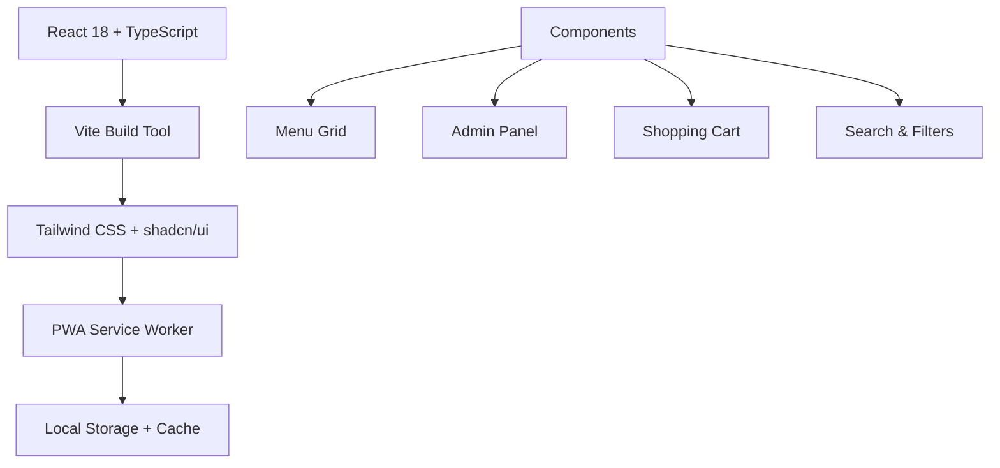
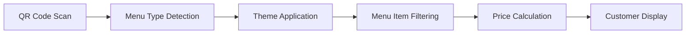

# 📚 Paradise Family Restaurant - Documentation Index

Welcome to the comprehensive documentation for Paradise Family Restaurant's digital menu system. This index will help you find the information you need quickly.

## 🚀 Getting Started

| Document | Description | Audience |
|----------|-------------|----------|
| **[README.md](README.md)** | Main project overview and quick start | Everyone |
| **[GITHUB_SETUP.md](GITHUB_SETUP.md)** | Complete GitHub repository setup guide | Developers |
| **[CONTRIBUTING.md](CONTRIBUTING.md)** | How to contribute to the project | Contributors |

## 📱 User Experience

| Document | Description | Use Case |
|----------|-------------|----------|
| **[PRD.md](PRD.md)** | Product Requirements Document | Product planning |
| **[MOBILE-RESPONSIVE-UPDATES.md](MOBILE-RESPONSIVE-UPDATES.md)** | Mobile optimization details | UX improvements |
| **[PWA_ENHANCEMENTS.md](PWA_ENHANCEMENTS.md)** | Progressive Web App features | App-like experience |

## 🛠️ Technical Documentation

### Development & Setup
| Document | Description | Use Case |
|----------|-------------|----------|
| **[PRODUCTION_READY.md](PRODUCTION_READY.md)** | Production deployment checklist | Going live |
| **[SECURITY.md](SECURITY.md)** | Security best practices | Safe deployment |
| **[package.json](package.json)** | Dependencies and scripts | Development setup |

### Firebase Integration (Legacy)
| Document | Description | Status |
|----------|-------------|---------|
| **[FIREBASE_REMOVAL.md](FIREBASE_REMOVAL.md)** | Firebase removal documentation | ✅ Completed |
| **[FIRESTORE-SECURITY.md](FIRESTORE-SECURITY.md)** | Security rules (archived) | 📁 Archive |
| **[FIREBASE-SETUP.md](FIREBASE-SETUP.md)** | Setup guide (archived) | 📁 Archive |

## 🏪 Restaurant Operations

| Document | Description | Audience |
|----------|-------------|----------|
| **[ADMIN_SETUP.md](ADMIN_SETUP.md)** | Admin panel user guide | Restaurant staff |
| **[UPDATES_SUMMARY.md](UPDATES_SUMMARY.md)** | Feature update history | Management |

## 🔧 Deployment & Infrastructure

| Document | Description | Use Case |
|----------|-------------|----------|
| **[DEPLOYMENT.md](DEPLOYMENT.md)** | Comprehensive deployment guide | DevOps |
| **[SECURITY-DEPLOYMENT-CHECKLIST.md](SECURITY-DEPLOYMENT-CHECKLIST.md)** | Security deployment checklist | Production |

## 📊 Project Management

### Issue Templates
- **[Bug Report Template](.github/ISSUE_TEMPLATE/bug_report.md)** - Report bugs effectively
- **[Feature Request Template](.github/ISSUE_TEMPLATE/feature_request.md)** - Suggest new features
- **[Pull Request Template](.github/pull_request_template.md)** - Submit code changes

### Workflows
- **[GitHub Actions Workflow](.github/workflows/deploy.yml)** - Automated CI/CD pipeline
- **[Dependabot Config](.github/dependabot.yml)** - Dependency management

## 🎨 Design & Assets

| Resource | Description | Location |
|----------|-------------|----------|
| **Design System** | Color themes and typography | [src/index.css](src/index.css) |
| **Components** | UI component library | [src/components/](src/components/) |
| **Assets** | Images and media files | [src/assets/](src/assets/) |

## 🍽️ Restaurant Information

### Business Details
- **Name**: Paradise Family Restaurant & Bake Shop
- **Location**: Chalakudy, Kerala, India
- **Specialties**: Kerala, Arabic & Chinese Cuisine
- **Features**: Fresh Bakery, Multiple Dining Options

### Menu System
- **🟠 Non-AC Dining**: Cozy atmosphere pricing
- **🔵 A/C Dining**: Premium experience pricing  
- **🟢 Takeaway**: Quick service pricing

### Contact Information
- **📍 Address**: Chalakudy, Kerala
- **📱 Instagram**: [@paradise.chalakudy](https://www.instagram.com/explore/locations/1026441532/chalakudy-paradise-restaurant/)
- **🗺️ Maps**: [Google Maps Location](https://maps.google.com)

## 📱 Application Architecture

### Technology Stack


### Data Flow


## 🔍 Quick Reference

### Common Commands
```bash
# Development
npm run dev          # Start development server
npm run build        # Build for production
npm run preview      # Preview production build

# Quality Assurance  
npm run lint         # Code linting
npm run type-check   # TypeScript validation
npm test             # Run tests
```

### Important URLs
- **🌟 Live App**: https://paradise-family.web.app
- **📱 Non-AC Menu**: https://paradise-family.web.app?menu=dinein-non-ac
- **🏢 A/C Menu**: https://paradise-family.web.app?menu=dinein-ac  
- **🛍️ Takeaway**: https://paradise-family.web.app?menu=takeaway

### File Structure
```
paradise-family-restaurant/
├── 📁 .github/              # GitHub templates and workflows
├── 📁 src/                  # Application source code
├── 📁 public/               # Static assets and PWA files  
├── 📄 README.md             # Main documentation
├── 📄 package.json          # Project dependencies
└── 📄 vite.config.ts        # Build configuration
```

## 🆘 Troubleshooting

### Common Issues
1. **Menu not loading**: Check network connection and try refreshing
2. **QR code not working**: Verify URL parameters are correct
3. **Admin access denied**: Confirm password and admin permissions
4. **Mobile performance**: Clear browser cache and cookies

### Support Channels
- **🐛 Bug Reports**: Use GitHub Issues with bug template
- **💡 Feature Requests**: Use GitHub Issues with feature template
- **❓ Questions**: Check existing documentation first

## 📈 Project Status

### Current Version
- **Version**: v2.0.0
- **Status**: Production Ready ✅
- **Last Updated**: August 2024

### Recent Updates
- ✅ Full mobile responsiveness
- ✅ PWA installation support
- ✅ Advanced search and filters
- ✅ Shopping cart functionality
- ✅ Performance optimizations

### Upcoming Features
- 🔄 Multi-language support (Malayalam, Arabic)
- 🔄 Push notification system
- 🔄 Advanced analytics dashboard
- 🔄 Loyalty program integration

---

## 🎯 Navigation Tips

### For New Contributors
1. Start with [CONTRIBUTING.md](CONTRIBUTING.md)
2. Review [PRD.md](PRD.md) for project context
3. Check [GITHUB_SETUP.md](GITHUB_SETUP.md) for repository setup

### For Developers  
1. Read [README.md](README.md) for technical overview
2. Follow [PRODUCTION_READY.md](PRODUCTION_READY.md) for deployment
3. Use [SECURITY.md](SECURITY.md) for security guidelines

### For Restaurant Staff
1. Consult [ADMIN_SETUP.md](ADMIN_SETUP.md) for admin panel usage
2. Review [UPDATES_SUMMARY.md](UPDATES_SUMMARY.md) for new features

---

**🍽️ Thank you for being part of Paradise Family Restaurant's digital transformation!**